

||**UNIVERSIDAD NACIONAL DE SAN AGUSTIN FACULTAD DE INGENIERÍA DE PRODUCCIÓN Y SERVICIOS ESCUELA PROFESIONAL DE INGENIERÍA DE SISTEMA**||
| - | :-: | - |
|**Formato:** Guía de Práctica de Laboratorio / Talleres / Centros de Simulación|
|**Aprobación: 2022/03/01**|**Código: GUIA-PRLE-001**|**Página:** 1|

**INFORME DE LABORATORIO**

|**INFORMACIÓN BÁSICA**|
| - |
|**ASIGNATURA:**|PROGRAMACIÓN WEB 2|
|**TÍTULO DE LA PRÁCTICA:**|*JavaScript*|
|**NÚMERO DE PRÁCTICA:**|*02*|**AÑO LECTIVO:**|*2023*|**NRO. SEMESTRE:**|*I*|
|**FECHA DE PRESENTACIÓN**|*22/05/2023*|**HORA DE PRESENTACIÓN**|*23:59 pm*|
|
**INTEGRANTE (s):**

- Alfonso Huacasi Alejandro Sebastian
|**NOTA:**||
|
**DOCENTE(s):**

**- Anibal Sardon**
|

|**SOLUCIÓN Y RESULTADOS**|
| - |
|
**I. SOLUCIÓN DE EJERCICIOS/PROBLEMAS**

- **GITHUB: [https://github.com/Sebastianzzzin/proyecto.git**](https://github.com/Sebastianzzzin/proyecto.git)**

- **VIDEO EN FLIPGRID:**

**Ejercicio 1:** Escriba una función que reciba el número de día de la fecha actual new Date() y devuelva
|
|el texto del día de las semanas correspondientes. Por ejemplo si recibe 0, devolvería “Domingo”.|
||
|- La variable declarada day y utilizamos el switch para evaluar el valor devuelto por la función|
|new Date().getDay(). Esta función obtiene el día actual de la semana como un número, donde el|
|domingo es 0, el lunes es 1, y así sucesivamente hasta el día viernes que sería el 6.|
|- Dentro de la estructura switch, se definen varios casos, cada uno correspondiente a un día de la|
|semana. Cuando se encuentra un caso que coincide con el valor devuelto por getDay(), se|
|ejecuta el código asociado a ese caso. En cada caso, se asigna un nombre de día de la semana a|
|la variable "day" correspondiente. Por ejemplo, si el día actual es 0, se asigna el valor|
|"Domingo" a la variable "day".|

||**UNIVERSIDAD NACIONAL DE SAN AGUSTIN FACULTAD DE INGENIERÍA DE PRODUCCIÓN Y SERVICIOS ESCUELA PROFESIONAL DE INGENIERÍA DE SISTEMA**||
| - | :-: | - |
|**Formato:** Guía de Práctica de Laboratorio / Talleres / Centros de Simulación|
|**Aprobación: 2022/03/01**|**Código: GUIA-PRLE-001**|**Página:** 2|

- Después de cada asignación, se utiliza la instrucción break para salir del switch y evitar que se ejecuten los casos siguientes.
- Fuera del switch, se utiliza el método getElementById("demo") para obtener una referencia al elemento HTML con el id "demo". Se modifica el contenido del elemento HTML usando la propiedad innerHTML. En este caso, se concatena el texto "Hoy es " con el valor de la variable "day" y se asigna como contenido del elemento.

||**UNIVERSIDAD NACIONAL DE SAN AGUSTIN FACULTAD DE INGENIERÍA DE PRODUCCIÓN Y SERVICIOS ESCUELA PROFESIONAL DE INGENIERÍA DE SISTEMA**||
| - | :-: | - |
|**Formato:** Guía de Práctica de Laboratorio / Talleres / Centros de Simulación|
|**Aprobación: 2022/03/01**|**Código: GUIA-PRLE-001**|**Página:** 3|

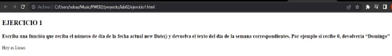

**Ejercicio 2:** Escriba una página web que reciba un texto y al presionar un botón muestre el mismo texto invertido en otra sección (div). Por ejemplo si se escribe “Hola”, se mostraría como “aloH”.

- Se define una función llamada textoInvertido que toma un parámetro t.
- Dentro de la función, se obtiene el valor de un elemento HTML utilizando document.getElementById(t).value. El parámetro t representa el id del elemento HTML que contiene el texto que se desea invertir, eso almacena la variable x.
- Se declara una variable llamada aux para almacenar el texto invertido. Se inicializa como una cadena vacía.

\-

- Se inicia un bucle for que recorre cada carácter del texto, comenzando desde el último carácter (x.length-1) hasta el primer carácter (0), en orden inverso. En cada iteración del bucle, se agrega el carácter actual al final de la cadena aux utilizando x.charAt(i).
- Después de que el bucle for finalice, se actualiza el contenido de un elemento HTML con el id "rpta" utilizando document.getElementById("rpta").innerHTML. El contenido se establece como el mensaje "El texto invertido es " seguido del valor almacenado en la variable aux, que representa el texto invertido.

\- Demostración:

||**UNIVERSIDAD NACIONAL DE SAN AGUSTIN FACULTAD DE INGENIERÍA DE PRODUCCIÓN Y SERVICIOS ESCUELA PROFESIONAL DE INGENIERÍA DE SISTEMA**||
| - | :-: | - |
|**Formato:** Guía de Práctica de Laboratorio / Talleres / Centros de Simulación|
|**Aprobación: 2022/03/01**|**Código: GUIA-PRLE-001**|**Página:** 4|

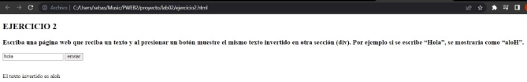

**Ejercicio 3:** Escribir una página que muestre cuántos días faltan para el día de Arequipa!

- Se utiliza la función window.onload para asegurarse de que el script se ejecute una vez que la página se haya cargado completamente.
- Se crea un objeto Date almacenado en la variable hoy que representa la fecha actual.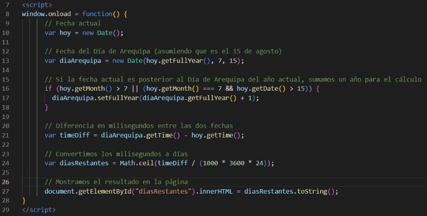
- Se crea otro objeto Date almacenando en la var diaArequipa que representa la fecha del Día de Arequipa. En este caso, se asume que el Día de Arequipa es el 15 de agosto. Se utiliza el año actual de "hoy" y se establece el mes como 7 (agosto) y el día como 15.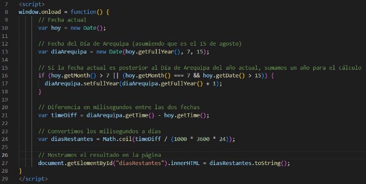
- Se verifica si la fecha actual es posterior al Día de Arequipa del año actual. Si es así, se suma un año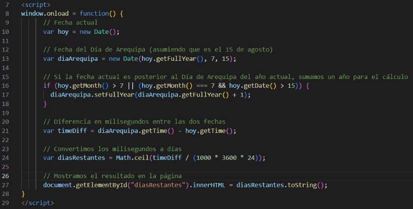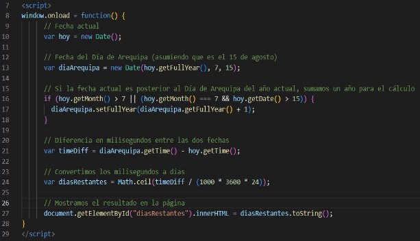 al objeto diaArequipa para asegurarse de que se esté calculando la diferencia correcta para el próximo Día de Arequipa.
- Se calcula la diferencia en milisegundos entre la fecha del Día de Arequipa y la fecha actual, utilizando la función getTime(), que devuelve el número de milisegundos.
- La diferencia en milisegundos se divide entre el número de milisegundos en un día (1000 \* 3600

\* 24) para obtener el número de días restantes.

||**UNIVERSIDAD NACIONAL DE SAN AGUSTIN FACULTAD DE INGENIERÍA DE PRODUCCIÓN Y SERVICIOS ESCUELA PROFESIONAL DE INGENIERÍA DE SISTEMA**||
| - | :-: | - |
|**Formato:** Guía de Práctica de Laboratorio / Talleres / Centros de Simulación|
|**Aprobación: 2022/03/01**|**Código: GUIA-PRLE-001**|**Página:** 5|

- Se utiliza Math.ceil() para redondear hacia arriba el resultado, asegurándose de que el número de días restantes se muestre como un número entero.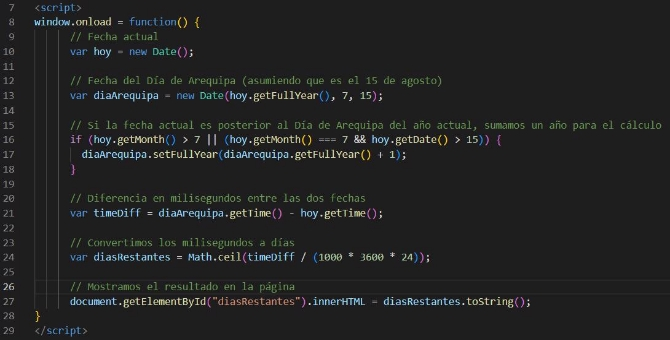
- Finalmente, se actualiza el contenido de un elemento HTML con el id "diasRestantes" utilizando document.getElementById("diasRestantes").innerHTML. El contenido se establece como el número de días restantes hasta el próximo Día de Arequipa.
- Demostración:

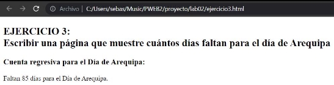

**Ejercicio 4:** Escribir una página que reciba la URL de la sesión de google meet de hoy y devuelva el código de la sesión sin guiones separados

- La función obtenerCodigoSesion() se llama cuando se activa algún evento como hacer click en un botón) y se encarga de obtener el código de sesión a partir de una URL ingresada en un campo de entrada (urlInput). Se obtiene el valor de la URL ingresada utilizando document.getElementById("urlInput").value y lo almacena en la variable url.
- Se llama a la función obtenerCodigoDesdeURL(url) pasando la URL como argumento para obtener el código de sesión.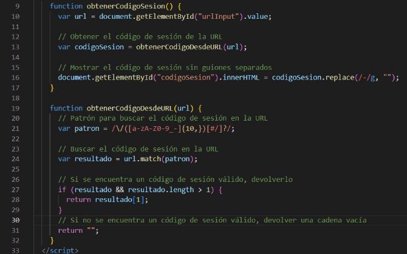

||**UNIVERSIDAD NACIONAL DE SAN AGUSTIN FACULTAD DE INGENIERÍA DE PRODUCCIÓN Y SERVICIOS ESCUELA PROFESIONAL DE INGENIERÍA DE SISTEMA**||
| - | :-: | - |
|**Formato:** Guía de Práctica de Laboratorio / Talleres / Centros de Simulación|
|**Aprobación: 2022/03/01**|**Código: GUIA-PRLE-001**|**Página:** 6|

- Se actualiza el contenido de un elemento HTML con el id "codigoSesion" utilizando document.getElementById("codigoSesion").innerHTML.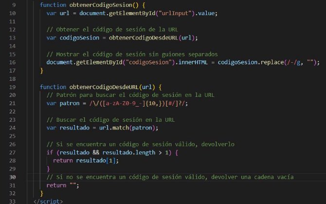 El contenido se establece como el código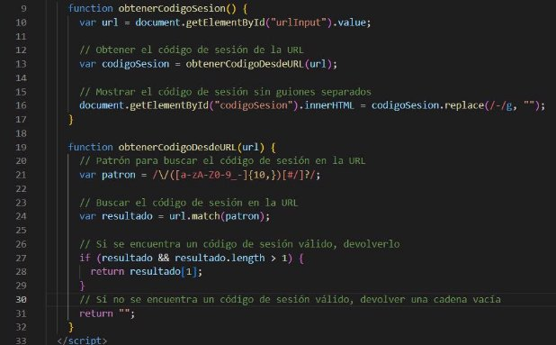 de sesión obtenido, pero sin los guiones ("-") separados. Esto se logra utilizando el método replace() con una expresión regular (/-/g) para reemplazar todos los guiones por una cadena vacía.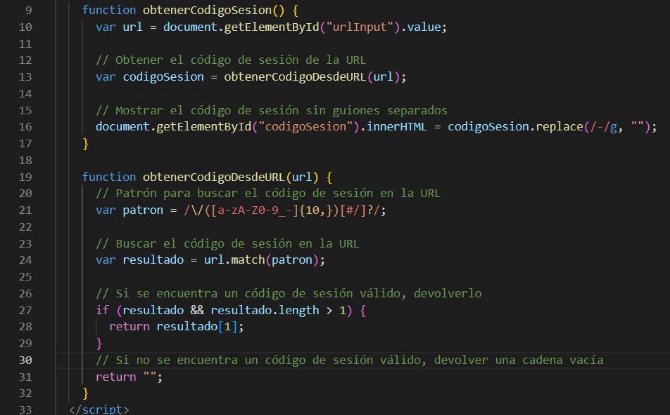
- La función obtenerCodigoDesdeURL(url) recibe una URL como parámetro y busca un código de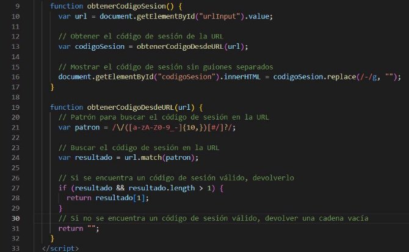 sesión en dicha URL utilizando una expresión regular. Se define un patrón de expresión regular (/\/([a-zA-Z0-9\_-]{10,})[#/]?/) para buscar un código de sesión en la URL.
- Utilizamos el método match() de la cadena de la URL con el patrón definido para buscar una coincidencia. El resultado se almacena en la variable resultado.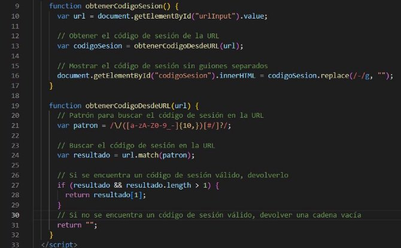
- Se verificará si se encontró un código de sesión válido en la URL mediante la condición resultado && resultado.length > 1. Si se cumple, devuelve el código de sesión encontrado (resultado[1]), de lo contrario, se es que no se encuentra un código de sesión válido, devuelve una cadena vacía.

\- Demostración:

||**UNIVERSIDAD NACIONAL DE SAN AGUSTIN FACULTAD DE INGENIERÍA DE PRODUCCIÓN Y SERVICIOS ESCUELA PROFESIONAL DE INGENIERÍA DE SISTEMA**||
| - | :-: | - |
|**Formato:** Guía de Práctica de Laboratorio / Talleres / Centros de Simulación|
|**Aprobación: 2022/03/01**|**Código: GUIA-PRLE-001**|**Página:** 7|

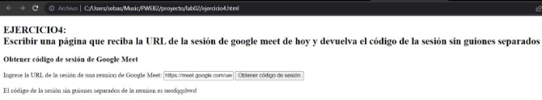

**Ejercicio 5:** Escribir una página que permita calcular la suma de todos los valores de una tabla de valores dinámica. La idea es crear una página web con un formulario que te permita decir cuántos valores tendrás la tabla, luego, al enviar el formulario la tabla se debe crear dinámicamente, junto con otro botón de enviado para calcular la suma.

- La función createTable() se activa al enviar un formulario y crea una tabla dinámicamente. La cantidad de filas en la tabla se basa en el número ingresado en un campo de entrada con el id "num-values". Cada fila contiene una celda con un campo de entrada numérico. La tabla resultante se inserta en un contenedor con el id "table-container".

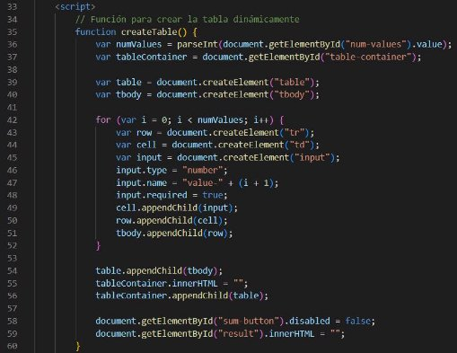

- En la función calculateSum() se activa al hacer click en un botón con el id "sum-button" y calcula la suma de los valores ingresados en los campos de entrada numéricos de la tabla. El resultado se muestra en un elemento HTML con el id "result".

||**UNIVERSIDAD NACIONAL DE SAN AGUSTIN FACULTAD DE INGENIERÍA DE PRODUCCIÓN Y SERVICIOS ESCUELA PROFESIONAL DE INGENIERÍA DE SISTEMA**||
| - | :-: | - |
|**Formato:** Guía de Práctica de Laboratorio / Talleres / Centros de Simulación|
|**Aprobación: 2022/03/01**|**Código: GUIA-PRLE-001**|**Página:** 8|

|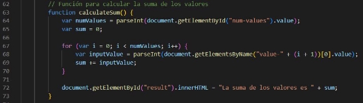|
| - |
|- Se agrega un event listener al formulario con el id "value-form". Cuando se envía el formulario,|
|se evita el comportamiento predeterminado (recargar la página) y se llama a la función|
|
createTable().

|
|- Se agrega un event listener al botón con el id "sum-button". Cuando se hace clic en el botón, se|
|llama a la función calculateSum().|
||
|
- Demostración:

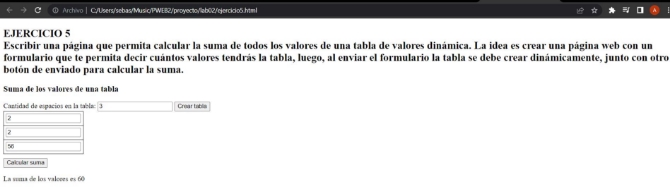
|
|**II. SOLUCIÓN DEL CUESTIONARIO**|

||**UNIVERSIDAD NACIONAL DE SAN AGUSTIN FACULTAD DE INGENIERÍA DE PRODUCCIÓN Y SERVICIOS ESCUELA PROFESIONAL DE INGENIERÍA DE SISTEMA**||
| - | :-: | - |
|**Formato:** Guía de Práctica de Laboratorio / Talleres / Centros de Simulación|
|**Aprobación: 2022/03/01**|**Código: GUIA-PRLE-001**|**Página:** 9|

||
| :- |
|
**III. CONCLUSIONES**

- En este laboratorio, pudimos realizar nuestras scripts en JS, implementarlas en nuestros html y haciendo más dinámico nuestro trabajo, además de haber realizado nuevamente el trabajo en git.
|

|**RETROALIMENTACIÓN GENERAL**|
| - |
||

|**REFERENCIAS Y BIBLIOGRAFÍA**|
| - |
|*Tutoría Javascript. <https://www.w3schools.com/javascript/default.asp> , 2021. Acceso: 02-09-2021.*|
|*Loiane Groner. Aprendizaje de estructuras de datos y algoritmos de JavaScript: escritura compleja y*|
|*poderosa*|
|*Validador HTML - [https://validator.w3.org/*](https://validator.w3.org/)*|
|*Validador CSS - [https://jigsaw.w3.org/css-validator/*](https://jigsaw.w3.org/css-validator/)*|
||

